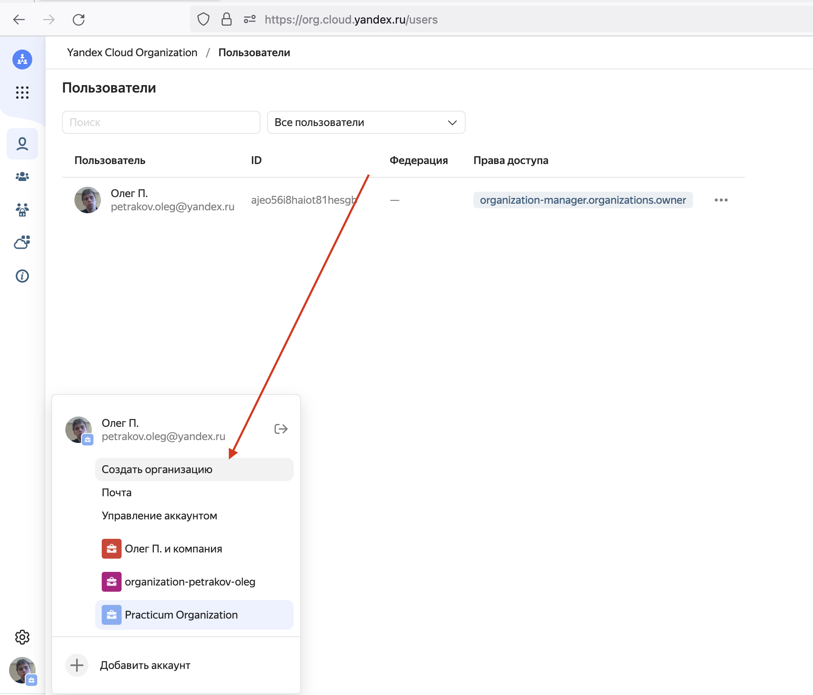

# Подписанные URL (SAS)

## About

Подписанный URL-адрес (SAS) обеспечивает безопасный делегированный доступ к ресурсам в вашей учетной записи хранения. С помощью SAS вы можете детально контролировать, как клиент может получить доступ к данным. Пример:

* Ресурсы, к которым может получить доступ клиент.
* Какие разрешения они имеют для этих ресурсов.
* Срок действия SAS.

## SAS types

Служба хранилища Azure поддерживает три типа подписанных URL:

* SAS делегирования пользователя
* SAS службы
* SAS учетной записи

### SAS делегирования пользователя

SAS делегирования пользователя защищен с учетными данными Azure Active Directory (Azure AD), а также с разрешениями, указанными для SAS. SAS делегирования пользователя применяется только к хранилищу BLOB-объектов.

### SAS службы

SAS службы защищен с помощью ключа учетной записи хранения. SAS службы делегирует доступ к ресурсу только в одной из служб хранилища Azure: хранилище BLOB-объектов, хранилище очередей, хранилище таблиц или файлы Azure.

### SAS учетной записи

SAS учетной записи защищен с помощью ключа учетной записи хранения. SAS учетной записи делегирует доступ к ресурсам в одной или нескольких службах хранилища. Все операции, доступные через SAS службы или делегирования пользователя, также доступны через SAS учетной записи.

Вы также можете делегировать доступ следующим параметрам:

* Операции уровня службы (например, **свойства Get/Set Service** и **Get Service stats** ).
* Операции чтения, записи и удаления, которые не разрешены с помощью SAS службы.

## Пример



```python
def SAS(blob_service_client):
    from azure.storage.blob import ResourceTypes, AccountSasPermissions, generate_account_sas
    from datetime import datetime, timedelta

    sas_token = generate_account_sas(
        blob_service_client.account_name,
        account_key=blob_service_client.credential.account_key,
        resource_types=ResourceTypes(object=True),
        permission=AccountSasPermissions(read=True),
        expiry=datetime.utcnow() + timedelta(hours=1)
    )

    print(sas_token)
    
"""
se=2021-03-31T23%3A01%3A39Z&sp=r&sv=2020-06-12&ss=b&srt=o&sig=HNbAxDHAi5epKsMeHQBGfXPEYU%2B8ZxXUUjj/6jitpZM%3D
"""
```

## Papers

Link: [https://docs.microsoft.com/ru-ru/azure/storage/common/storage-sas-overview](https://docs.microsoft.com/ru-ru/azure/storage/common/storage-sas-overview)
