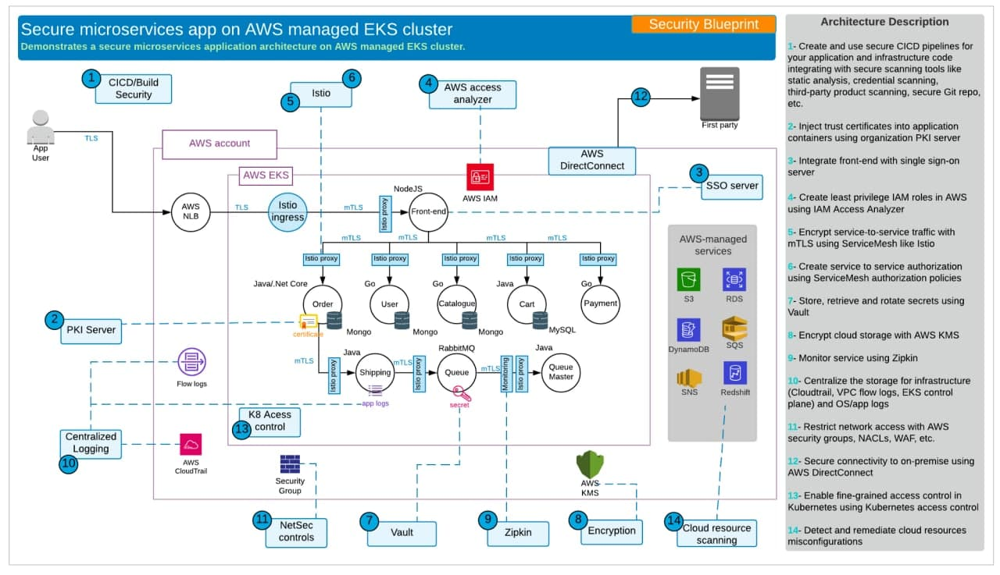

# Papers

Статья от John Kinsella о том, как он видит безопасный pipeline для AWS, Azure и GCP - [https://theresnomon.co/what-modern-ci-cd-should-look-like-e6f50594c2d2](https://theresnomon.co/what-modern-ci-cd-should-look-like-e6f50594c2d2)

Проект, в котором собраны всякие заметки (не мало) по безопасности облаков [https://hackingthe.cloud/](https://hackingthe.cloud/). git проекта: [https://github.com/Hacking-the-Cloud/hackingthe.cloud](https://github.com/Hacking-the-Cloud/hackingthe.cloud)

И еще **лучше** ресурс, чем предыдущий: [https://cloudsecdocs.com/](https://cloudsecdocs.com/)

От Carlos (hacktricks) — [https://cloud.hacktricks.xyz/welcome/readme](https://cloud.hacktricks.xyz/welcome/readme)


Про безопасность AWS, Azure, GCP


## Примеры

Построение безопасной архитектуры на основе микросервисов на примере AWS: [https://ab-lumos.medium.com/embedding-security-into-sdlc-using-reference-architectures-for-developers-29403c00fb3d](https://ab-lumos.medium.com/embedding-security-into-sdlc-using-reference-architectures-for-developers-29403c00fb3d)

<figure><figcaption></figcaption></figure>

## Certifications

Есть сайт [https://www.practical-devsecops.com](https://www.practical-devsecops.com), где курсы и сертификации с достаточно большим объемом информации (судя по содержанию). Возможно, просто набросали кучу информации из разных тем и областей (а каждая из этих областей сама по себе требует по несколько месяцев изучения).

Например: CCNSE — Certified Cloud-Native Security Expert
