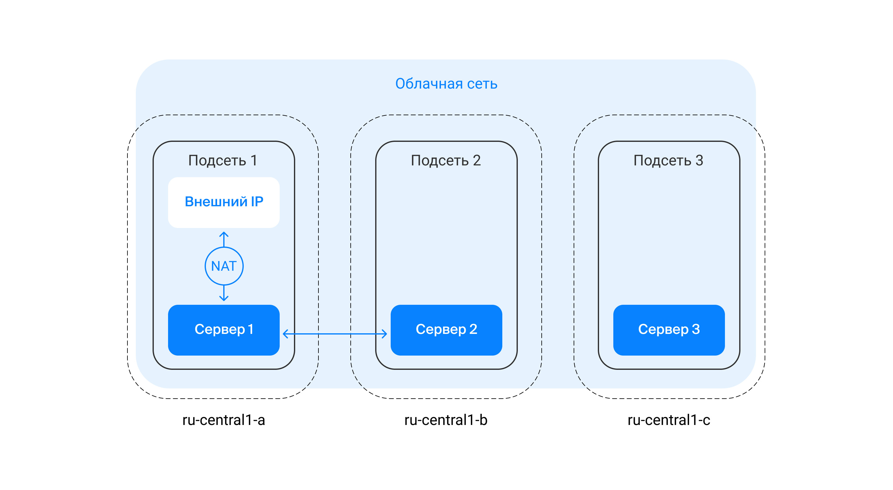

# Security

## Authentication and authorization

### Через Яндекс ID

В YaCloud пользователь аутентифицируется через Яндекс ID, получает аутентификационную куку на домен `.yandex`. Она обменивается в YaCloud на аутентификационную куку на домен `cloud.yandex.LTD`. Далее, эта кука обменивается на авторизационный IAM-токен. С помощью IAM-токена пользователь авторизуется в API Yandex Cloud и выполняет операции с ресурсами.

Если вы работаете в интерфейсе командной строки (CLI), то на вашем компьютере будет сохранен OAuth-токен Яндекс ID. Утилита `yc` будет обменивать этот токен на IAM-токены со сроком жизни 12 часов  для взаимодействия с API Yandex Cloud.

### Через федерацию удостоверений

Удостоверения (credentials) — это информация об атрибутах пользователей, таких как логин или адрес электронной почты, и способах аутентификации. При использовании федерации удостоверений они хранятся не у облачного провайдера, а у третьей доверенной стороны — поставщика удостоверений (IdP, Identity Provider).

В Yandex Cloud вы можете создать федерацию удостоверений с помощью сервиса Yandex Cloud Organization. Этот сервис работает с любой системой управления учётными записями, которая поддерживает протокол [SAML](https://cloud.yandex.ru/docs/organization/add-federation) (например Active Directory или Google Workspace).

### Через сервисные аккаунты

Аутентифицированные пользователи могут выполнять действия из-под сервисных аккаунтов.

Аутентификацию сервисного аккаунта можно выполнять тремя способами:

1. **Авторизованные ключи.** Используются для получения IAM-токена с помощью открытого и секретного ключа. Этот способ вы примените в следующей практической работе.
2. **API-ключи.** Используются в некоторых сервисах для упрощённой аутентификации вместо IAM-токена. Могут пригодиться для работы с сервисами SpeechKit, Vision и Translate.
3. **Статические ключи доступа.** Необходимы при использовании AWS-совместимых сервисов, например в Object Storage или Message Queue.

**Можно и нужно** создавать сервисные аккаунты на каталог или ресурс (например, ВМ). Они имеют ограниченные роли и будут прокинуты в каждый? ресурс.

При использовании сервисных аккаунтов рекомендуется:

* для назначения сервисного аккаунта на виртуальную машину и получения токена использовать **сервис метаданных**;
* настроить на виртуальной машине локальный **файрвол**;
* обеспечить **безопасное хранение и управление ключами** сервисного аккаунта;
* следовать принципу **минимальных привилегий** и назначать сервисному аккаунту только те роли, которые необходимы для работы приложения;
* следовать принципу **минимальных привилегий** и в отношении доступа к самому сервисному аккаунту, то есть выдавать роли на него минимальному кругу пользователей и только при необходимости

## Ресурсная модель и права доступа

Сервис IAM используется не только для того, чтобы контролировать доступ к облачным ресурсам. С его помощью также назначают права доступа. Для этого применяют ролевую модель управления доступом — **RBAC** (Role Based Access Control). То есть каждому пользователю можно назначить определённую роль для доступа к тому или иному ресурсу.

Роли на ресурс назначаются в виде списка связей «роль — субъект». Такие связи называются привязками прав доступа (access bindings).

Роли наследуются: все разрешения от родительского ресурса переходят на его дочерние ресурсы.

Если у пользователя есть роли и на родительский, и на дочерний ресурс, то для дочернего ресурса будет действовать объединенный список разрешений. Иными словами, ограничить список разрешений, унаследованных от родительского ресурса, на уровне дочернего не получится.

### Привилегированные пользователи

К привилегированным пользователям относятся учетные записи со следующими ролями:

* `resource-manager.clouds.owner`;
* `billing.accounts.owner`;
* роль `admin`, назначенная всему облаку;
* роль `admin`, назначенная каталогу;
* роль `admin`, назначенная платежному аккаунту.

Если ваша компания использует [федерацию удостоверений](https://cloud.yandex.ru/docs/organization/quick-start), то рекомендуется назначить `resource-manager.clouds.owner` роль одному или нескольким сотрудникам. Их федеративные аккаунты должны быть надёжно защищены с помощью:

* двухфакторной аутентификации;
* запрета на аутентификацию с посторонних устройств;
* мониторинга попыток входа и заданных порогов предупреждений.

Для аккаунта Яндекс ID, под которым создано облако, нужно назначить сложный пароль, а использовать его — только в случае крайней необходимости (например, если федерация сломалась).

Роли `admin` на облака, каталоги и платежные аккаунты рекомендуется назначать только федеративным учетным записям. При этом число таких учетных записей должно быть минимально необходимым, а потребность пользователей в такой роли следует регулярно перепроверять.

Безопасности аккаунта с ролью `billing.accounts.owner` следует уделять повышенное внимание, поскольку он обладает значительными полномочиями и не может быть подключен к федерации корпоративных аккаунтов.

Наиболее правильным подходом можно считать отказ от регулярного использования аккаунта с этой ролью, то есть его нужно использовать только при первоначальной настройке и при внесении изменений. На время активного использования этого аккаунта включите [двухфакторную аутентификацию](https://yandex.ru/support/id/authorization/twofa.html) (2FA) в Яндекс ID. Затем, если вы не используете способ оплаты банковской картой (доступный только для данной роли), назначьте этому аккаунту сложный пароль, сгенерированный с помощью специализированного ПО, отключите 2FA и не используйте этот аккаунт без необходимости.

После каждого использования генерируйте новый пароль. Отключение 2FA для этого аккаунта важно в ситуации, если аккаунт не закреплён за конкретным сотрудником. Это позволяет избежать привязки критически важного аккаунта к личному устройству.

### Использование ресурсной модели

Если система должна соответствовать требованиям [PCI DSS](https://ru.wikipedia.org/wiki/PCI\_DSS), то при разработке модели доступа для создаваемой инфраструктуры рекомендуется использовать следующий подход:

* все ресурсы, которые входят в область соответствия PCI DSS, нужно поместить в отдельное облако;
* группы ресурсов, которые требуют разного административного доступа, помещают в разные каталоги (например, DMZ, security, backoffice и т.д.);
* общие ресурсы (например, сеть и группы безопасности) помещают в отдельный каталог для разделяемых ресурсов.

Последние два пункта стоит иметь в виду при построении любой сложной инфраструктуры в облаке, даже если требования PCI DSS вас пока не беспокоят.

## Принципы обеспечения сетевой безопасности

Общую архитектуру можно представить следующим образом:

<figure><figcaption></figcaption></figure>

### Доступность ресурсов

Располагаем ресурсы во всех сетевых зонах

### Периметр безопасности

Для построения периметра безопасности используются следующие подходы:

* В сети создают несколько подсетей с разными политиками выхода в интернет с помощью трансляции адресов (NAT). В Yandex Cloud есть два варианта: непосредственно включить NAT для подсети или создать NAT-инстанс — хост с сетевым интерфейсом, публичным IP-адресом и преднастроенными правилами маршрутизации и трансляции IP-адресов, через который ресурсы подсети получат доступ в интернет. NAT обеспечивает сетевую безопасность за счёт того, что сетевая топология и внутренние IP-адреса ресурсов не видны из-за пределов сети. Однако нужно понимать, что сам по себе NAT не может заменить межсетевые экраны.
* Если виртуальной машине не нужна связь с ресурсами в интернете, её следует размещать в подсети, для которой выход в интернет отключён.
* Для работы со входящим трафиком следует использовать лишь минимально необходимое число открытых портов и внешних IP-адресов для подключения. Целесообразно использовать сетевой балансировщик трафика для группы виртуальных машин во внутренней сети.
* Безопасно администрировать виртуальные машины можно через консоль управления Yandex Cloud. Также поможет VPN-шлюз на виртуальной машине с внешним IP-адресом. Это позволит сократить количество внешних адресов и открытых портов для обслуживания облачной инфраструктуры.
* Для ресурсов с внешними IP-адресами следует включить сервис защиты от DDoS-атак. Этот сервис помогает бороться с атаками на уровень L7 [сетевой модели OSI](https://ru.wikipedia.org/wiki/%D0%A1%D0%B5%D1%82%D0%B5%D0%B2%D0%B0%D1%8F\_%D0%BC%D0%BE%D0%B4%D0%B5%D0%BB%D1%8C\_OSI), которые направлены на исчерпание ёмкости канала и вычислительных ресурсов виртуальных машин. Для защиты веб-ресурсов в этом случае можно использовать один из сервисов WAF (Web Application Firewall), доступных на Marketplace.

### Принцип наименьших привилегий

Этот принцип требует, чтобы каждый ресурс в вашем облаке был связан только с теми ресурсами в облаке или интернете, которые необходимы для его корректной работы.

Чтобы реализовать этот принцип на практике, используют **группы безопасности**. Такая группа назначается сетевому интерфейсу при создании или изменении виртуальной машины. Она содержит правила, которые определяют протоколы и IP-адреса для получения и отправки трафика. Группы безопасности действуют по принципу «запрещено всё, что не разрешено».

Группы безопасности используются для контроля входящего и исходящего трафика, то есть выполняют функцию межсетевого экрана. Фактически они представляют собой набор правил, которые назначаются сетевому интерфейсу. Эти правила устанавливают протоколы и диапазоны адресов и портов для получения и отправки трафика. Правила для входящего и исходящего трафика определяют отдельно.

Основной принцип, по которому работают группы безопасности: запрещено всё, что не разрешено в явном виде.

Группы безопасности можно применять в сервисах Yandex Cloud:

* Compute Cloud
* Instance Groups
* Сетевой балансировщик нагрузки (Важно: для такого сценария группы безопасности применяются к ВМ за балансировщиком, а не к самому балансировщику.)
* Прикладной балансировщик нагрузки (L7-балансировщик; Application Load Balancer)

## Серийная консоль

Помните, что все пользователи с правом доступа к серийной консоли могут увидеть сессию, просмотреть действия других пользователей и подключиться к незавершённой сессии.Чтобы обезопасить себя:

* включайте серийную консоль только при крайней необходимости;
* давайте доступ узкому кругу пользователей, которым доверяете;
* придумывайте стойкие пароли для доступа к ВМ;
* после работы с серийной консолью отключайте доступ к ней в ВМ.
* Управляемые базы данных (Как и в группах виртуальных машин, в сервисах управляемых баз данных группа безопасности назначается на кластер целиком. Назначить на отдельные хосты разные группы безопасности нельзя.)
