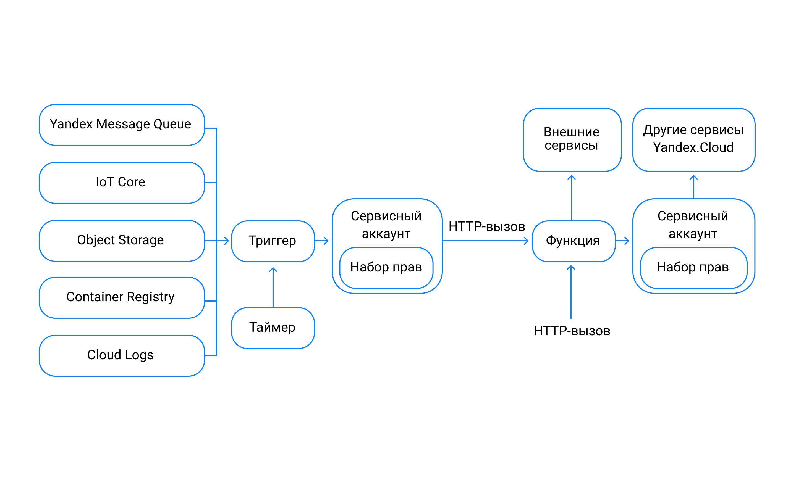
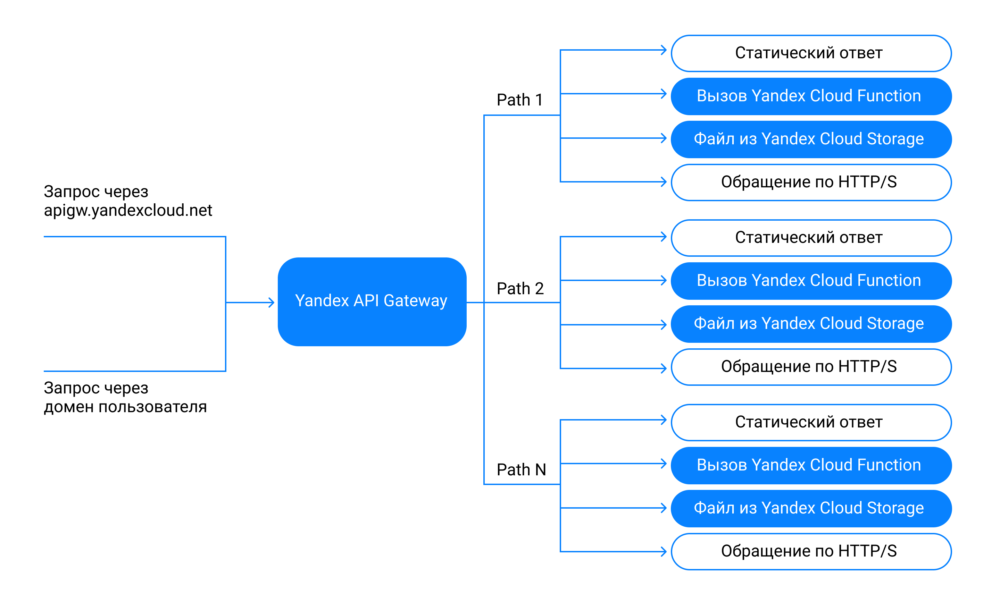

# Serverless

* Yandex Cloud Functions (CF)
* API Gateway
* Serverless YDB
* Yandex Message Queue

## Cloud Functions (CF)

Function-As-A-Service

### Usage

Создать CF:

```
$ yc serverless function create --name my-first-function 

done (1s)
id: d4eor1nq6c7natelf0dl
...
http_invoke_url: https://functions.yandexcloud.net/d4eor1nq6c7natelf0dl
...
```

Загрузить код функции в облако и создать ее версию:

```
$ yc serverless function version create \
   --function-name my-first-function \
   --memory 256m \
   --execution-timeout 5s \
    --runtime python37 \
    --entrypoint main.handler \
    --service-account-id $SERVICE_ACCOUNT_ID \
    --source-path main.py 
```

Вызов функции:

```
$ yc serverless function list
$ yc serverless function version list --function-name my-first-function 
$ yc serverless function invoke <идентификатор_функции> 
```

Сделать функцию публичной:

```
$ yc serverless function allow-unauthenticated-invoke my-first-function
```

Получить публичную ссылку на функцию

```
$ yc serverless function get my-first-function 
```

### Нюансы

Каждая функция должна соответствовать [модели программирования](https://cloud.yandex.ru/docs/functions/concepts/function#programming-model).

### Триггеры

Можно вызывать функцию при наступлении какого-то события. Причем и при наступлении событий в других сервисах. Примерно это выглядит так:

<figure><figcaption></figcaption></figure>

## API Gateway

Прокси сервер

<figure><figcaption></figcaption></figure>

## Serverless YDB

Отличие от обычной YDB, что здесь поддерживается Document API (совместимое с AWS Dinamo DB)
