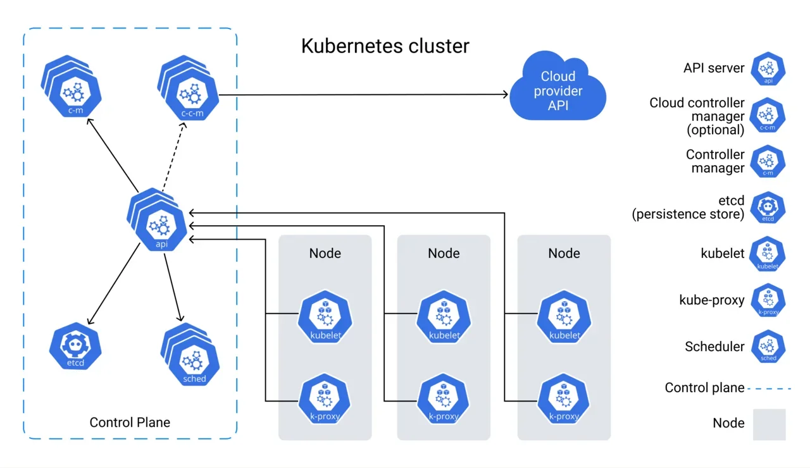

# About

Site: [https://kubernetes.io/](https://kubernetes.io/)

Наиболее популярная система управления контейнерами

### Из чего состоит Kubernetes

В Kubernetes контейнеры или наборы контейнеров размещаются на **подах** (pod). Под — это логический хост. Один или несколько подов, а также сервисы для управления подами образуют **узел**, или **ноду** (node). Узел — это рабочая машина, виртуальная либо физическая. Однотипные узлы образуют **группу узлов**.

В свою очередь, узлы объединяются в **кластер**. У каждого кластера есть своя панель управления (control plane), именно она и обеспечивает оркестрацию. Один из узлов кластера становится главным — **мастером** (master). Он запускает управляющие процессы Kubernetes: сервер Kubernetes API, планировщик и контроллеры основных ресурсов.

<figure><figcaption></figcaption></figure>

В одном физическом кластере могут находиться несколько виртуальных. Виртуальный кластер называется **пространством имён** (namespace). В отличие от нод и подов, которые в кластере есть всегда, пространства имён надо использовать тогда, когда в них возникает реальная необходимость. Например, если приложение состоит из сервисов, то для каждого сервиса стоит создать пространство имён. Это поможет управлять разделением ресурсов физического кластера между сервисами.

### Автомасштабирование

Для автомасштабирования подходят инструменты, встроенные в Kubernetes: **Horizontal Pod Autoscaler** и **Cluster Autoscaler**. Они решают разные задачи и могут работать как по отдельности, так и совместно.Horizontal Pod Autoscaler, как понятно из названия, масштабирует поды: увеличивает и уменьшает их количество, когда изменяется нагрузка. Cluster Autoscaler управляет количеством узлов, на которых поды запущены.
